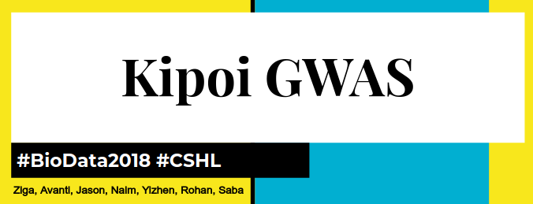
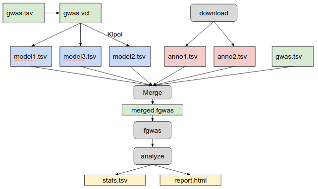

# `Kipoi-GWAS`

Kipoi-GWAS is a snakemake pipeline which 
- downloads UK BioBank association files
- merges the annotation files with variant effect predictions using Kipoi 
- runs FGWAS to fine-map variants
- generates a report 

A sample report can be found here: [src/fgwas_plot.ipynb](src/fgwas_plot.ipynb).

## General workflow of Kipoi-GWAS


## Installation

1. Clone the git repo.

```
git clone https://github.com/NCBI-Hackathons/Kipoi-GWAS
```

2. Install conda environment.

```
conda env create -f environment.yml
```

3. Install the python package
```
cd Kipoi-GWAS; pip install .
```


## Folder structure 

Here is the complete folder structure.

```
input/
  UKBB/  # UK-biobank phenotypes downloaded from the UK Biobank site. Select phenotypes of interest. TODO
    {phenotype}.gwas.imputed_v3.both_sexes.tsv.bgz
	{phenotype}.gwas.imputed_v3.both_sexes.tsv   # after untarring the .bgz file
  anno/  # variant annotation of the phenotypes found in UKBB
    kipoi/  # annotated variants using `kipoi veff score_variants`
	  subset/
  	    {chr}/
		  {model}.tsv.gz

	

output/
  {phenotype}/
    subset/
	  {chr}/
	    {run-id}/
		  metadata.json  # information about the run
		  fgwas/
		    input/   # input tables for fgwas
		    output/  # output of fgwas, includes default outputs
		  report/  # reports
  		    fig1.ipynb
		     fig1.html
```
